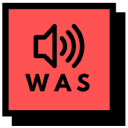

  
  <h1>What a Sound !?</h1>
  
Meme sound effects for your daily web interactions

  

    
  

## Features

### Core Functionality
- **Copy (Ctrl+C):** Plays a designated sound effect when you copy text.
- **Paste (Ctrl+V):** Plays a designated sound effect when you paste text.
- **Text Selection:** Plays a designated sound effect right after you highlight/select text.
- **No Autoplay Issues:** Sounds play upon direct interaction (keydown, mouseup), complying flawlessly with browser autoplay policies.

### Management & Customization
- **Neubrutalism UI:** Configure everything in a stylish, blocky, and bold options page.
- **Sound Configuration:** Map different meme sounds (e.g. Vine Boom, Perfect Fart, Akh, Faaah, Gey Echo) to different actions.
- **Global Toggle:** Easily enable or disable the sounds globally.

## Setup

### Adding Custom Sounds
1. Obtain `.mp3` or `.wav` audio files.
2. Place them perfectly inside the `/assets/sounds/` directory.
3. Update `src/options.html`, `src/options.js`, and `src/content.js` to list the exact filenames.

## Installation

1. Download or clone this repository.
2. Open Chrome and go to `chrome://extensions/`
3. Enable "Developer mode" in the top right.
4. Click "Load unpacked" and select the extension folder.

## Usage

1. Click the extension icon to manage the designated sound effects or enable/disable them.
2. On any website, press `Ctrl+C`, `Ctrl+V`, or select text to hear the sounds!

## Support This Project

If you find this extension hilarious or helpful, consider supporting:

### 🗣️ Feedback & Requests
Want a specific meme sound added? Or maybe a custom trigger for something else? Just [ping me on GitHub](https://github.com/ayogatot/what-a-sound/issues) or open an issue!

### ☕ Buy Me a Coffee

### ⭐ Star on GitHub
If you like this project, give it a star! It helps others discover it.

## Contributing

Feel free to submit issues, feature requests, or pull requests to improve this extension.

## License

This project is licensed under the MIT License - see the [LICENSE](LICENSE) file for details.

---

Created with ❤️ by [@ayogatot](https://github.com/ayogatot)
